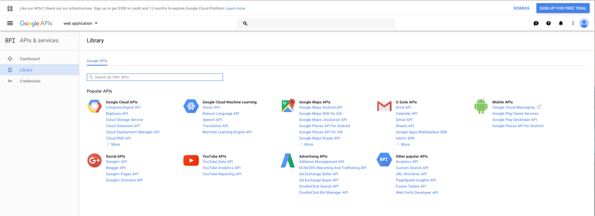
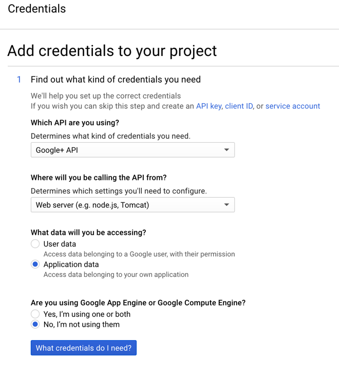
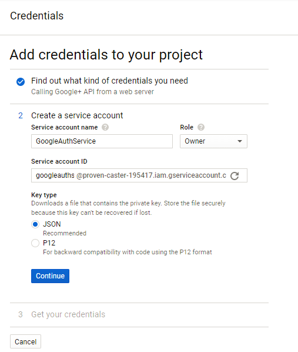
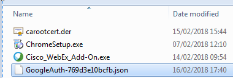
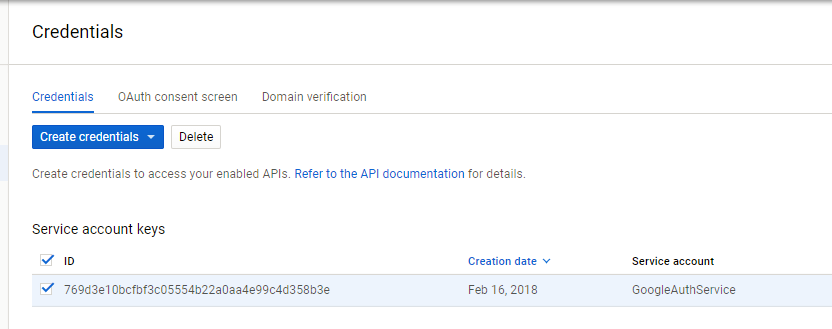
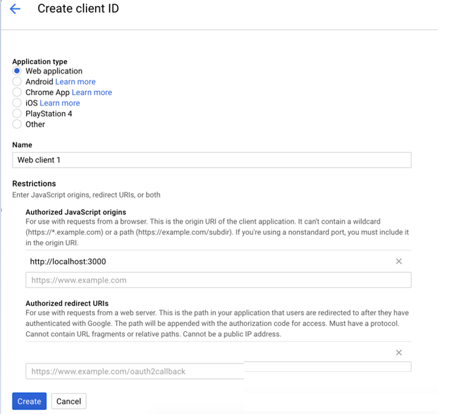
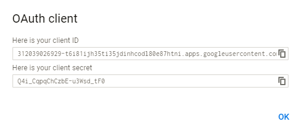

 

The section below describes how the Google Authentication scheme in this tutorial was set up, in advance of this tutorial.

Google+ Authentication Configuration & Setup
-------------------------------------------------------

The appendix below describes how to create an OAUTH2.0 authentication service for authenticating client applications. These steps at a high-level overview consist of:

1.  Create Google API+ Project
2.  Create Credentials Service Account
3.  Create OAuth2.0 Consent
4.  Create OAuth2.0 Client ID credentials for the Credentials Service Account

Step A1: Create Google API+ Project
-----------------------------------

1.  Login to your Google account - if you don't have one - create one at google.com and **sign in to Google**
    
2.  Link for the page [https://console.developers.google.com/apis/](https://console.developers.google.com/apis/)
    

You should see the following page on arrival. Search for ‘Google+’ in the search bar and select the **Google+** APIs icon when presented.

1.  Once selected - click to Enable the Google+ APIs - it is important that you do this.
    
2.  As you don’t have a 'project' yet, you will be prompted to create a project as it is needed to enable the APIs. Click ‘Create Project’
    
3.  You will be prompted to give it a name - call it 'GoogleAuth' and **take a note of the Project ID** in our case it is shown as `proven-caster-195417` \- this will be used later on.
    
4.  After creating the project, you will be redirected to the Google+ API page again. You should now see the project name selected and the option to ‘Enable’ the service. Click ‘Enable’.
    

Step A2: Create Credentials Service Account
-------------------------------------------

1.  Once you have enabled the service you will be prompted to create Service Account Credentials so that you can use the service. Click ‘Create Credentials’.
    
2.  You will be asked a series of questions to determine what kind of credentials you will need. Give the answers shown in the screenshot below. Choose 'Google+ API' for the API, Web Server (e.g. Node js, Tomcat) and Application data and 'No' for the Engine question at the bottom.
    
3.  Click on `What credentials do I need` and hit Continue
    

1.  Next, setup a Credentials service account - with the name 'GoogleAuthService' - select 'Project' in the dropdown and select a role of `Owner` and a type of JSON and
    
2.  Click on 'Get your Credentials' - it should download (or prompt to download) the service credentials in JSON format - save these to a safe location.
    

1.  Save a JSON file with the application credentials. After downloading the credentials, the site will take you back to the credentials homepage and you will see a new service account key.

Step A3: Create OAUTH2.0 Consent
--------------------------------

1.  Go to the ‘OAuth consent screen' tab = you will need to give a 'product name' like 'Google Auth REST OAUTH2 service' - a banner that is shown when consent to authorize a request is requested (ie when we test it on the REST client in the main tutorial) and an email address, click ‘Save’.

The OAuth consent screen is what the user (in the tutorial) will see when they are authenticating themselves against the Google Auth REST Service

Step A4: Create OAuth2.0 Client ID credentials for the Credentials Service Account
----------------------------------------------------------------------------------

1.  Go back to the ‘Credentials’ tab and click the ‘Create Credentials’ dropdown and select ‘OAuth Client ID’.
    
2.  Choose 'Web Application' and give it a simple name like 'Smart Quora Client'
    
3.  Under the 'Authorised Javascript Origins' section add a line with the following URI - this is the client application (the REST Server):
    
    [http://your-host-name:3000](http://your-host-name:3000)
    
4.  We will need to add 'Authorized Redirect URIs' at the bottom - this is where the authenticated session is redirected back to after getting consent from the Google+ OAUTH2.0 authentication service. The callback will match what we will configure in our Composer REST Server environment variables (specifically the variable `COMPOSER_PROVIDERS` when performing this instruction in the main tutorial).
    

Under 'Authorized Redirect URIs' add the following URIs as authorised URIs. Note: it is best to copy/paste each URI below, then hit ENTER in the browser after each line entry- as the URI line editor can sometimes truncate your entry whilst typing .e.g. if you happen to pause when typing the URI.

    http://your-host-name:3000/auth/google
    http://your-host-name:3000/auth/google/callback
    

Then click on the 'Create' button at the bottom.

You will be prompted to save the Client ID and Client Secret - copy these two and save these for later.

You're all set - you can now return to the main tutorial to set up your REST Server Authentication using Google's OAUTH2.0 client authentication service.

Sourced from: https://hyperledger.github.io/composer/latest/tutorials/google_oauth2_rest
